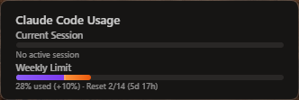

# Claude Code Usage Dashboard

Claude Code の API 使用量をリアルタイムで監視するデスクトップウィジェットです。




## 機能

- **セッション使用量** (5時間枠) と **週間使用量** (7日枠) をプログレスバーで表示
- 使用量が時間経過に対して超過している場合、オレンジ色で警告表示
- 60%/80% の閾値で色が変化 (黄色→赤)
- リセットまでの残り時間をカウントダウン表示
- リセット時刻の到達を検知して自動リフレッシュ
- 常に最前面に表示 (トグル可)
- ウィンドウの透過度・背景エフェクト (Mica / Acrylic) のカスタマイズ
- ポーリング間隔の変更 (30秒〜5分)
- システムトレイからの表示/非表示切り替え
- ドラッグ移動・リサイズ対応

## 前提条件

- [Claude Code](https://docs.anthropic.com/en/docs/claude-code) がインストール済みで、OAuth 認証が完了していること
  - `~/.claude/.credentials.json` に認証情報が保存されている必要があります
- [Node.js](https://nodejs.org/) (v18 以上)
- [pnpm](https://pnpm.io/)
- [Rust](https://www.rust-lang.org/tools/install)

## セットアップ

```bash
# 依存パッケージのインストール
pnpm install

# 開発モードで起動
pnpm tauri dev

# プロダクションビルド
pnpm tauri build
```

## 使い方

1. アプリを起動すると、小さなウィジェットが画面上に表示されます
2. ウィジェットをドラッグして好きな位置に配置できます
3. **右クリック** でコンテキストメニューを開き、以下をカスタマイズできます:
   - 透過度 (Opacity)
   - 背景エフェクト (Transparent / Mica / Acrylic)
   - 常に最前面表示の ON/OFF
   - ポーリング間隔
   - 手動リフレッシュ
4. システムトレイアイコンからウィジェットの表示/非表示を切り替えられます

## 技術スタック

- **フロントエンド**: TypeScript + HTML/CSS (Vanilla)
- **バックエンド**: Rust (Tauri 2)
- **ビルドツール**: Vite
- **パッケージマネージャー**: pnpm

## ライセンス

[MIT](LICENSE)
