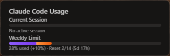

# Claude Code Usage Dashboard

[🇯🇵 日本語版 README はこちら](README_jp.md)

An integrated desktop widget for real-time monitoring of Claude Code and GitHub Copilot API usage.




## Features

### Claude Code Usage Monitoring
- Displays **session usage** (5-hour window) and **weekly usage** (7-day window) as progress bars
- Shows an orange warning when usage exceeds what is expected for the time elapsed
- Color changes at 60%/80% thresholds (yellow → red)
- Countdown display showing time remaining until reset
- Automatically refreshes when the reset time is reached

### GitHub Copilot Usage Monitoring (Optional)
- Displays **monthly usage** as a progress bar
- Authentication via GitHub Personal Access Token
- Visually distinguished from Claude with a green color scheme
- GitHub PAT can be configured from the Context Menu

### Customization & Controls
- **Meter visibility toggle**: Show/hide the Claude meter and Copilot meter independently
  - Settings are persisted in localStorage and retained after app restarts
- **Auto-launch**: Automatically start the app at login
  - Can be toggled on/off from the Context Menu
- Always-on-top display (toggleable)
- Window opacity and background effect customization (Mica / Acrylic)
- Polling interval adjustment (30 seconds to 5 minutes)
- Show/hide toggle from the system tray
- Drag to move and resize support

## Supported Platforms

- **Windows** (Windows 10/11)
- **Linux** (Ubuntu, Debian, Fedora, etc.)
- **macOS** (keyring uses `apple-native` implementation — untested)

### Using with WSL

- **Claude Code inside WSL**: If you are using Claude Code in a WSL environment, specify the WSL credentials file path via the right-click menu.
- **Credentials file path format**: Must be specified in UNC format:
  ```
  \\wsl.localhost\<distribution-name>\home\<username>\.claude\.credentials.json
  ```
  Example: `\\wsl.localhost\Ubuntu-24.04\home\user\.claude\.credentials.json`
- After entering the path, click the **Save** button in the context menu to save.

## Prerequisites

### Required
- [Claude Code](https://docs.anthropic.com/en/docs/claude-code) installed with OAuth authentication completed
  - Authentication information must be saved at `~/.claude/.credentials.json`
- [Node.js](https://nodejs.org/) (v18 or higher)
- [pnpm](https://pnpm.io/)
- [Rust](https://www.rust-lang.org/tools/install)

### Optional (for GitHub Copilot monitoring)
- A GitHub Personal Access Token (PAT) is required
  - Scope: `copilot` permission required
  - Can be generated from [GitHub Settings](https://github.com/settings/tokens)

## Installation

### Option 1: Use Pre-built Packages (Recommended)

#### Linux (Ubuntu/Debian)

```bash
# 1. Download the .deb file from the GitHub Releases page
#    Get the latest .deb file from the repository's Releases page
wget <release-url>/usage-dashboard_0.1.0_amd64.deb

# 2. Install
sudo dpkg -i usage-dashboard_0.1.0_amd64.deb

# If dependency errors occur
sudo apt-get install -f

# 3. Run
usage-dashboard
```

#### Linux (AppImage — universal, works on all distributions)

```bash
# 1. Download the AppImage
#    Get the latest .AppImage file from the GitHub Releases page
wget <release-url>/usage-dashboard_0.1.0_amd64.AppImage

# 2. Make it executable
chmod +x usage-dashboard_0.1.0_amd64.AppImage

# 3. Run
./usage-dashboard_0.1.0_amd64.AppImage
```

#### Windows

Download and run the `.msi` installer from the GitHub Releases page.

### Option 2: Build from Source

```bash
# Install dependencies
pnpm install

# Run in development mode
pnpm tauri dev

# Production build
pnpm tauri build
```

## Usage

### Basic Controls

1. When the app launches, a small widget appears on screen.
2. Drag the widget to position it anywhere you like.
3. **Right-click** to open the context menu and customize:
   - Opacity
   - Background effect (Transparent / Mica / Acrylic) ※Windows only
   - Always-on-top ON/OFF
   - Polling interval
   - Manual refresh
   - **Meter visibility**: Show/hide the Claude meter and GitHub Copilot meter individually
   - **Auto-launch settings**: Toggle automatic startup at login ON/OFF
4. Use the system tray icon to show or hide the widget.

### GitHub Copilot Setup (Optional)

To monitor GitHub Copilot usage:

1. Generate a Personal Access Token (PAT) in [GitHub Settings](https://github.com/settings/tokens)
   - Scope: grant `copilot` permission
2. **Right-click** the widget to open the context menu
3. In the GitHub Copilot section of the menu, fill in:
   - **Username**: Your GitHub username
   - **Token**: The PAT you generated
   - **Monthly Limit**: Your monthly usage limit (default: 300)
4. Click the **Save** button to save

> The token is stored securely in the OS keyring (Windows: Windows Credential Manager, macOS: Keychain, Linux: Secret Service). It is never written to `config.json`.

## Data Storage Locations

| Data Type | Storage Location |
|-----------|------------------|
| App settings (WSL path, GitHub username, etc.) | `~/.usage-dashboard/config.json` |
| GitHub PAT (token) | OS keyring (Windows Credential Manager / macOS Keychain / Linux Secret Service) |
| UI settings (opacity, visibility toggles, etc.) | `localStorage` (in-app) |

## Testing

```bash
# Frontend (TypeScript)
pnpm test                       # Unit tests
pnpm test:coverage              # With coverage

# Backend (Rust)
pnpm test:coverage:rust:text    # Coverage (text output)
pnpm test:coverage:rust         # Coverage (HTML output → coverage-rust/)

# Run both together
pnpm test:coverage:all
```

## Tech Stack

- **Frontend**: TypeScript + HTML/CSS (Vanilla)
- **Backend**: Rust (Tauri 2)
- **Build tool**: Vite
- **Package manager**: pnpm

## License

[MIT](LICENSE)
